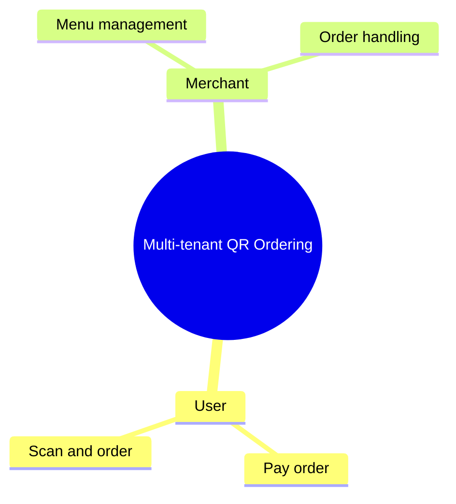

# Product Mindmap and Use Cases

```mermaid
mindmap
  root((Multi-tenant QR Ordering))
    User
      Scan and order
      Pay order
    Merchant
      Menu management
      Order handling
```

- UC01 Create order
- UC02 Payment callback
- UC03 Query order