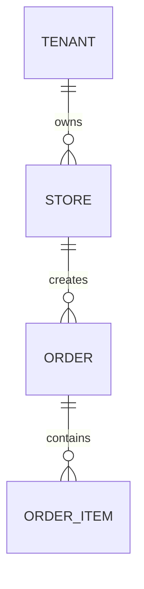

# Domain Model and Physical Schema

```mermaid
erDiagram
  TENANT ||--o{ STORE : owns
  STORE ||--o{ ORDER : creates
  ORDER ||--o{ ORDER_ITEM : contains
```

- orders(id, tenant_id, store_id, status, total_amount)
- order_items(id, order_id, menu_item_id, qty)