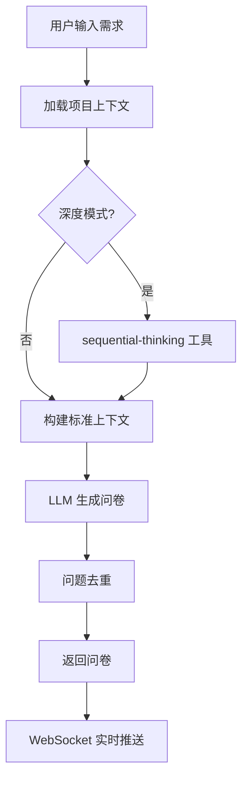
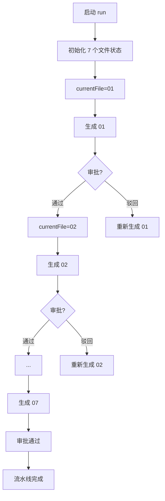
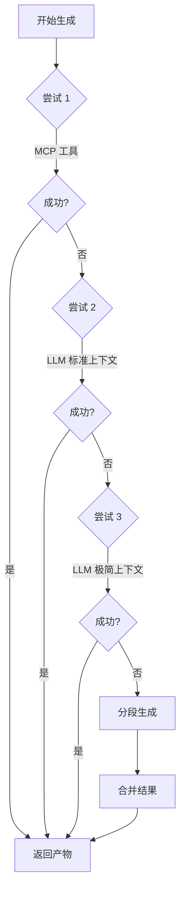

# JAP Plus 项目模块说明

## 项目概述

JAP Plus（Just Another Planner Plus）是一个基于 Node.js + TypeScript 开发的智能需求分析与软件设计系统。它集成大语言模型（LLM）和 Model Context Protocol（MCP）工具，实现从需求引出到设计文档生成的完整工程闭环。

**核心价值**：将不稳定的大模型生成转化为可控制、可回放、可降级的生产流水线。

---

## 技术架构

```
┌─────────────────────────────────────────────────────────────────┐
│                         前端界面层                                │
│                   (public/index.html)                           │
└───────────────────────────┬─────────────────────────────────────┘
                            │ HTTP / WebSocket
┌───────────────────────────▼─────────────────────────────────────┐
│                      API 路由层 (http/)                          │
│  ┌─────────────┐ ┌─────────────────┐ ┌─────────────────────┐   │
│  │ configRoutes│ │elicitationRoutes│ │    taskRoutes       │   │
│  └─────────────┘ └─────────────────┘ └─────────────────────┘   │
└───────────────────────────┬─────────────────────────────────────┘
                            │
┌───────────────────────────▼─────────────────────────────────────┐
│                     业务逻辑层                                   │
│  ┌─────────────┐ ┌─────────────┐ ┌─────────────┐ ┌───────────┐ │
│  │   nodes/    │ │  runtime/   │ │  services/  │ │   state/  │ │
│  │工作流节点    │ │运行时上下文 │ │  辅助服务   │ │ 状态定义  │ │
│  └─────────────┘ └─────────────┘ └─────────────┘ └───────────┘ │
└───────────────────────────┬─────────────────────────────────────┘
                            │
┌───────────────────────────▼─────────────────────────────────────┐
│                      工具集成层                                  │
│  ┌─────────────────────────┐    ┌─────────────────────────────┐ │
│  │    tools/mcpClient.ts   │◄──►│  MCP Servers                │ │
│  │    (MCP 客户端)          │    │  - filesystem               │ │
│  └─────────────────────────┘    │  - sequential-thinking      │ │
│  ┌─────────────────────────┐    │  - prd-creator              │ │
│  │  @langchain/openai      │◄──►│  LLM Providers              │ │
│  └─────────────────────────┘    └─────────────────────────────┘ │
└─────────────────────────────────────────────────────────────────┘
```

### 技术栈

| 层级     | 技术选型                       |
| ------ | -------------------------- |
| 运行时    | Node.js 18+ + TypeScript 6 |
| Web 框架 | Express 5                  |
| LLM 集成 | LangChain + OpenAI API     |
| 工作流引擎  | LangGraph                  |
| 实时通信   | WebSocket (ws 库)           |
| 数据验证   | Zod                        |
| MCP 集成 | @modelcontextprotocol/sdk  |
| 开发工具   | tsx (热重载)                  |

---

## 目录结构

```
├── src/
│   ├── constants/          # 常量定义（领域常量、提示词、日志文本）
│   ├── http/               # API 路由和 WebSocket 服务
│   ├── nodes/              # LangGraph 工作流节点
│   ├── runtime/            # 运行时上下文与事件管理
│   ├── services/           # 业务辅助服务
│   ├── state/              # 状态类型定义与校验
│   ├── tools/              # 工具类（MCP 客户端）
│   ├── index.ts            # 入口提示文件
│   └── server.ts           # 服务器启动配置
├── public/                 # 静态资源（前端界面）
├── logs/                   # 日志文件输出
├── tasks/                  # 运行时任务数据（动态生成）
├── _draft/                 # 需求草稿历史（动态生成）
├── .trae/skills/           # 技能定义文件
├── docs/legacy/            # 历史文档
├── package.json            # 项目依赖配置
└── tsconfig.json           # TypeScript 编译配置
```

---

## 核心模块详解

### 1. constants 模块（常量定义层）

**文件位置**：`src/constants/`

#### 1.1 domainConstants.ts - 领域常量

定义系统核心领域概念和文件编排规范：

```typescript
// 问题维度定义 - 需求征询的分类体系
QUESTION_DIMENSIONS = {
  core: "核心实体",       // 业务实体与领域对象
  state: "状态边界",      // 状态流转与边界条件
  security: "安全权限",   // 认证授权与安全策略
  dependency: "外部依赖"  // 外部系统与集成点
}

// 7 个标准产出物文件定义
ARTIFACT_FILES = {
  modeling01: "01_产品功能脑图与用例.md",      // 功能架构
  modeling02: "02_领域模型与物理表结构.md",    // 数据模型
  modeling03: "03_核心业务状态机.md",          // 状态设计
  modeling04: "04_RESTful_API契约.yaml",       // API 规范
  detailing05: "05_行为驱动验收测试.md",       // BDD 测试
  detailing06: "06_UI原型与交互草图.html",     // 原型设计
  detailing07: "07_API调试集合.json"           // Postman 集合
}
```

**设计意图**：

- 统一 01~07 文件命名规范，驱动流水线按序生成
- 问题维度为问卷生成提供结构化分类框架

#### 1.2 promptTexts.ts - 提示词模板

维护各阶段的 LLM 系统提示词：

| 提示词常量                          | 用途                    |
| ------------------------------ | --------------------- |
| `API_ELICITATION_PROMPT`       | 需求征询阶段 - 生成澄清问卷       |
| `API_FINALIZE_PROMPT`          | 需求最终化阶段 - 整合生成 PRD    |
| `MODELING_NODE_SYSTEM_PROMPT`  | 建模阶段 (01-04) - 系统架构设计 |
| `DETAILING_NODE_SYSTEM_PROMPT` | 细化阶段 (05-07) - 实现细节设计 |
| `REVIEW_NODE_SYSTEM_PROMPT`    | 评审阶段 - 质量检查与反馈        |
| `DEEP_THINKING_SYSTEM_PROMPT`  | 深度思考模式 - 复杂问题分析       |

**设计特点**：

- 提示词与代码分离，便于调优和版本管理
- 针对不同阶段定制上下文约束和输出格式要求

#### 1.3 logTexts.ts - 日志文本

统一 WebSocket 日志标题与降级提示文案，确保用户反馈的一致性。

---

### 2. http 模块（API 路由层）

**文件位置**：`src/http/`

#### 2.1 server.ts - 服务器入口

**职责**：

- Express 应用初始化与中间件配置（CORS、JSON 解析、静态文件）
- WebSocket 服务器注册（先于路由注册，确保依赖注入）
- API 路由批量注册
- HTTP 服务器启动

**关键代码**：

```typescript
const app = express();
app.use(cors());
app.use(express.json({ limit: "2mb" }));
app.use(express.static(path.resolve(process.cwd(), "public")));

const server = createServer(app);
const wss = registerWorkflowWebSocket(server);  // WebSocket 先注册

registerTaskRoutes(app, wss);        // 注入 wss 实例
registerElicitationRoutes(app, wss);
registerConfigRoutes(app);
```

#### 2.2 elicitationRoutes.ts - 需求引出路由

**核心端点**：

| 端点                                  | 方法   | 功能            |
| ----------------------------------- | ---- | ------------- |
| `/api/v1/elicitation/questionnaire` | POST | 生成需求澄清问卷      |
| `/api/v1/elicitation/finalize`      | POST | 整合问卷答案，生成最终需求 |

**问卷生成流程**：

```
接收请求 → 参数验证 → 加载项目上下文 → 深度思考(可选) 
    → LLM 生成问卷 → 问题去重 → WebSocket 实时推送 → 返回结果
```

**关键技术点**：

- **上下文构建**：自动读取 `package.json` / `README.md` / `.jap-skills.md` 等项目文件
- **深度模式**：调用 `sequential-thinking` MCP 工具生成思考轨迹
- **结构化输出**：使用 `withStructuredOutput(QuestionnaireSchema)` 确保格式合规
- **降级策略**：LLM 失败时返回 fallback 问卷，保证可用性
- **去重机制**：基于问题签名（`buildQuestionSignature`）识别重复问题

**需求最终化流程**：

```
接收请求 → 参数验证 → MCP 生成 PRD 草稿 → 草稿标准化 
    → 写入文件 → LLM 整合生成 → 返回最终需求 + 诊断信息
```

#### 2.3 taskRoutes.ts - 任务流水线路由（核心模块）

**职责**：实现 Filewise 单文件流水线，按 01~07 顺序逐个生成和审批设计文档。

**核心端点**：

| 端点                                                       | 方法   | 功能          |
| -------------------------------------------------------- | ---- | ----------- |
| `/api/v1/tasks/filewise/start`                           | POST | 启动新流水线运行    |
| `/api/v1/tasks/filewise/:runId`                          | GET  | 查询运行状态      |
| `/api/v1/tasks/filewise/:runId/generate-next`            | POST | 生成当前文件      |
| `/api/v1/tasks/filewise/:runId/files/:fileId/approve`    | POST | 审批通过，进入下一文件 |
| `/api/v1/tasks/filewise/:runId/files/:fileId/reject`     | POST | 驳回当前文件      |
| `/api/v1/tasks/filewise/:runId/files/:fileId/regenerate` | POST | 重新生成当前文件    |
| `/api/v1/tasks/filewise/:runId/files/:fileId/save-edit`  | POST | 保存人工编辑      |
| `/api/v1/history/requirements`                           | GET  | 查询历史需求列表    |
| `/api/v1/history/requirements/:id`                       | GET  | 查询历史需求详情    |

**文件状态机**：

```
PENDING ──► GENERATING ──► GENERATED ──► REVIEWING ──► APPROVED
    │           │              │              │
    │           ▼              ▼              ▼
    │         FAILED        REJECTED ◄───────┘
    │           │              │
    └───────────┴──────────────┘ (可重新生成)
```

**门禁规则**：

- 仅 `currentFile` 可操作
- `generate`：状态为 PENDING / FAILED / REJECTED
- `approve/reject`：状态为 GENERATED / REVIEWING
- `save-edit`：状态为 GENERATED / REVIEWING / REJECTED / FAILED

**生成主链路（三段式降级）**：

```
第1次尝试 ──► MCP 候选工具调用
    │
    ├─► 成功：返回产物
    │
    └─► 失败 ──► 第2次尝试 ──► LLM 标准上下文
                    │
                    ├─► 成功：返回产物
                    │
                    └─► 失败 ──► 第3次尝试 ──► LLM 极简上下文
                                    │
                                    ├─► 成功：返回产物
                                    │
                                    └─► 失败 ──► 分段生成 + 合并
```

**上下文压缩策略**：

- requirement：按字符上限裁剪（FILEWISE_CONTEXT_LIMIT = 10000）
- QA 快照：最多 30 个问题
- approvedSummary：已审批文件的摘要汇总
- skill：技能上下文裁剪

**产物清洗规则**：

- 自动剥离代码围栏（```）
- 06 文件强制以 `<!DOCTYPE html>` 起始
- 截断前置噪音内容

#### 2.4 configRoutes.ts - 配置路由

**端点**：

| 端点                                     | 方法              | 功能  |
| -------------------------------------- | --------------- | --- |
| `GET /api/v1/config`                   | 获取默认配置          |     |
| `POST /api/v1/config/llm/test`         | 测试 LLM 连通性      |     |
| `POST /api/v1/config/workspace/choose` | Windows 目录选择对话框 |     |

#### 2.5 websocket.ts - WebSocket 服务

**职责**：

- 在 Express HTTP 服务器上叠加 WebSocket 能力
- 维护活跃连接列表
- 实现事件广播机制
- 支持 ping/pong 保活

**事件类型**：

- `LOG_ADDED` - 日志推送
- `FILE_STAGE_CHANGED` - 文件状态变更
- `FILE_GENERATED` - 文件生成完成
- `FILE_APPROVED` - 文件审批通过
- `FILE_REJECTED` - 文件被驳回
- `RUN_POINTER_MOVED` - 流水线指针移动

---

### 3. nodes 模块（工作流节点）

**文件位置**：`src/nodes/`

#### 3.1 elicitationNode.ts - 需求引出节点

**职责**：

- 定义 LangGraph 工作流中的需求分析节点
- 处理需求征询的核心业务逻辑
- 与 LangGraph 状态机集成

**设计模式**：

- 遵循 LangGraph 节点函数签名 `(state) => Partial<State>`
- 纯函数设计，无副作用，便于测试和回放

---

### 4. runtime 模块（运行时支撑）

**文件位置**：`src/runtime/`

#### 4.1 skillContext.ts - 技能上下文管理

**职责**：

- 读取 `.jap-skills.md` 文件
- 包装 `[SkillRules]` 标签注入提示词
- **TTL 缓存**（默认 5 分钟）降低 IO 开销

**缓存策略**：

```typescript
const CACHE_TTL_MS = 5 * 60 * 1000;  // 5 分钟
// 文件 mtime 变化时自动失效
```

#### 4.2 workflowEvents.ts - 工作流事件总线

**职责**：

- 定义系统中使用的事件类型常量
- 提供事件触发接口（`emitLogAdded`、`emitTaskScopedEvent`）
- 通过 `setBroadcaster` 解耦业务事件与 WebSocket 传输
- 自动注入 `taskId` 和 `timestamp`

**事件结构**：

```typescript
{
  type: "LOG_ADDED" | "FILE_STAGE_CHANGED" | ...,
  runId: string,
  timestamp: string,
  payload: { ... }
}
```

---

### 5. services 模块（业务服务层）

**文件位置**：`src/services/`

#### 5.1 elicitationHelpers.ts - 需求引出辅助

**核心功能**：

| 函数                       | 用途                              |
| ------------------------ | ------------------------------- |
| `buildQuestionSignature` | 为问题生成唯一签名（用于去重）                 |
| `dedupeQuestions`        | 基于签名去重，限制 batchSize/targetTotal |
| `serializeAnswers`       | 答案序列化为标准化格式                     |
| `normalizePrdDraft`      | PRD 草稿标准化处理                     |

#### 5.2 structuredOutputFallback.ts - 结构化输出降级

**职责**：

- 处理 LLM 结构化输出失败的情况
- 从响应中抽取 JSON 子串
- 使用 Zod `safeParse` 校验并返回

**降级流程**：

```
结构化调用失败 ──► 提取 JSON 块 ──► Zod 校验
    │                      │
    │                      ├─► 成功：返回解析结果
    │                      │
    └──────────────────────┴─► 失败：返回 fallback 结构
```

---

### 6. state 模块（状态定义层）

**文件位置**：`src/state/japState.ts`

**Zod Schema 定义**：

```typescript
// 问题维度枚举
QuestionDimensionSchema = enum["核心实体", "状态边界", "安全权限", "外部依赖"]

// 问题定义
QuestionSchema = {
  id: string,
  dimension: QuestionDimensionSchema,
  questionType: enum["single", "multiple"],
  questionText: string,
  options: string[] (2-8 个)
}

// 问卷结构
QuestionnaireSchema = { questions: Question[] (0-100 个) }

// 建模阶段产出
ModelingOutputSchema = {
  "01_产品功能脑图与用例.md": string,
  "02_领域模型与物理表结构.md": string,
  "03_核心业务状态机.md": string,
  "04_RESTful_API契约.yaml": string
}

// 细化阶段产出
DetailingOutputSchema = {
  "05_行为驱动验收测试.md": string,
  "06_UI原型与交互草图.html": string,
  "07_API调试集合.json": string
}
```

**JapState 接口**：

- `originalRequirement`: 原始需求文本
- `questionnaire`: 问卷数据
- `userAnswers`: 用户答案映射
- `artifacts`: 生成的设计文档
- `llmConfig`: LLM 配置
- `workspaceConfig`: 工作区配置

---

### 7. tools 模块（工具集成层）

**文件位置**：`src/tools/mcpClient.ts`

#### 7.1 JapMcpClient - MCP 客户端

**职责**：

- 管理多 MCP 服务连接（filesystem、sequential-thinking、prd-creator）
- 提供工具发现和调用能力
- 实现项目上下文缓存

**核心方法**：

| 方法                           | 功能        |
| ---------------------------- | --------- |
| `getSharedClient()`          | 获取单例客户端实例 |
| `readProjectContext()`       | 读取项目文件上下文 |
| `callTextToolByCandidates()` | 按候选列表调用工具 |
| `generatePrdDraft()`         | 生成 PRD 草稿 |

**工具调用策略**：

```typescript
// 跨服务扫描 toolNames，命中后执行
candidates = [
  `generate_file_${fileId}`,    // 专用工具
  "generate_design_file",       // 通用设计工具
  "generate_artifact_file",     // 通用产物工具
  "generate_artifact"           // 兜底工具
]
```

---

## 核心业务流程

### 流程 1：需求引出流程



### 流程 2：文件流水线流程



### 流程 3：文件生成降级流程



---

## 数据持久化

### 运行时数据（tasks/）

```
tasks/{runId}/
├── meta.json          # 运行元数据（状态、配置、文件列表）
├── events.log         # 事件日志（可回放）
├── 01_产品功能脑图与用例.md
├── 02_领域模型与物理表结构.md
├── ...
└── 07_API调试集合.json
```

### 需求草稿（_draft/）

```
_draft/{timestamp}/
├── 00_prd_mcp_raw.md           # MCP 原始输出
├── 01_prd_mcp_normalized.md    # 标准化草稿
└── 03_final_requirement_fused.md # 最终需求
```

---

## 稳定性与超时治理

| 策略     | 实现                                          |
| ------ | ------------------------------------------- |
| 严格超时   | 不同链路独立超时（MCP: 30s, LLM: 45s, fallback: 35s） |
| 禁止隐式重试 | 关键调用 `maxRetries=0/1`，业务层显式重试               |
| 上下文控长  | `clampText` 裁剪、摘要替代全文、历史限量                  |
| 降级优先   | MCP → LLM → 极简模式 → 分段合并                     |
| 可追踪    | meta.json + events.log + WS 日志三位一体          |

---

## 扩展与定制

### 添加新的 MCP 工具

1. 在 `mcpClient.ts` 中添加工具调用方法
2. 在 `domainConstants.ts` 中定义新的产出物文件
3. 在 `taskRoutes.ts` 中集成到生成链路

### 自定义提示词

1. 在 `promptTexts.ts` 中添加新的提示词常量
2. 在路由或服务中引用

### 添加新的文件类型

1. 在 `ARTIFACT_FILES` 中添加文件定义
2. 在 `FILE_SPECS` 中配置 stage 和扩展名
3. 实现对应的生成逻辑

---

## 总结

JAP Plus 已形成"需求引出 → 文件化建模/细化 → 审批推进 → 全程留痕"的工程闭环：

1. **需求引出**：智能问卷生成，多模式分析（快速/深度）
2. **文件流水线**：7 个标准设计文档按序生成
3. **人机协作**：审批机制确保质量，支持人工编辑
4. **稳定可靠**：多级降级策略，确保可用性
5. **全程可追踪**：元数据 + 事件日志 + 实时推送
